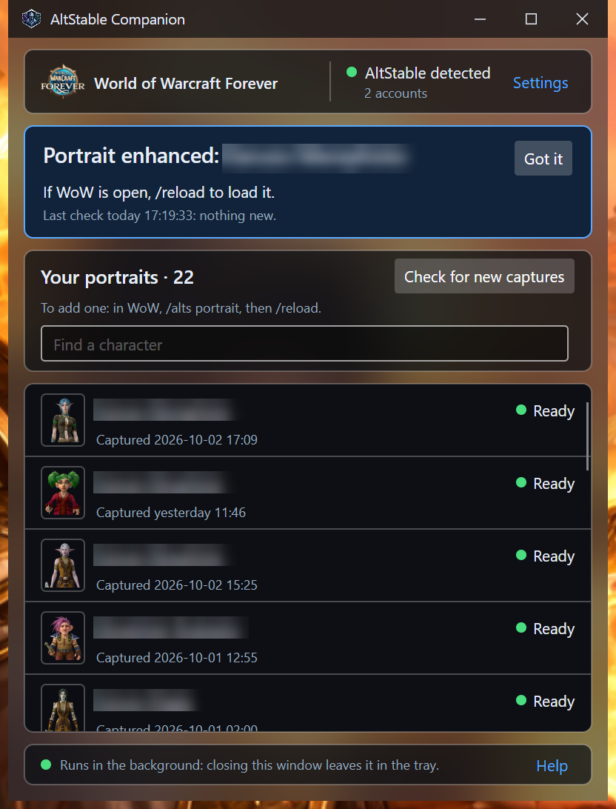

# AltStable Companion

A free Windows app for players of the [AltStable](https://github.com/Spotnick2/AltStable)
addon for World of Warcraft: Forever. It turns the portraits you capture in the game into
the cutouts the addon's Roster scene draws your characters with.

**Three pieces, and only the first is required:**

| Piece | What it is | Do you need it? |
|---|---|---|
| **AltStable** (the addon) | Tracks and compares your characters in the game | Yes. It is useful on its own |
| **AltStable Companion** (this app) | Turns your `/alts portrait` captures into Roster portraits | Only for portraits in the Roster |
| **Enhanced portraits** (a setting in this app) | Asks the Codex CLI on your PC for a nicer picture of each portrait | No: off by default, and it uses your ChatGPT account's usage |

## Install

1. Have the AltStable addon installed, from [CurseForge](https://www.curseforge.com/wow/addons/altstable). The captures come from it, and the portraits go
   back to it.
2. From the [releases page](https://github.com/Spotnick2/AltStableCompanion/releases),
   download `AltStableCompanion-<version>-win-x64.exe` (the newest one at the top). It is the
   whole app: Windows 10 or 11, 64-bit, nothing else to install (not .NET either). Put it in a
   folder you will keep, such as `Documents\AltStable Companion`, and run it.
3. Windows may show "Windows protected your PC", because the file is not code-signed. If
   it offers **More info → Run anyway**, that is the way through. A Windows 11 PC with Smart
   App Control turned on may not offer it; unsigned distribution is a limitation of this free
   tool for now.
4. The window opens near the tray. Read its first-start card, then press **Start watching**.
   The card says what will be converted, and that the two screenshots a portrait is made from
   are deleted afterwards unless you tick the box to keep them.

The app finds your game folder by itself. **Settings** shows which one it chose; use
**Browse...** if that is not the game you play AltStable in.

## Your first portrait

1. In the game, on the character you want, type `/alts portrait` (or press the spyglass
   button on AltStable's title bar). The interface hides for about three seconds while two
   screenshots are taken.
2. Accept the **reload** the addon offers, or type `/reload`. The capture is only saved
   to disk on a reload or logout, and that is when this app sees it.
3. Within seconds the app writes the portrait and says so.
4. **The very first time only: quit the game completely and start it again.** WoW only
   discovers a new addon folder (`AltStableCutouts`, which the app creates) when it starts.
   A `/reload` is not enough for that first one; the app's window says so too.

From then on, every new portrait shows after a `/reload`. Capture again whenever your
character's look changes; the spyglass button glows when a new portrait is due.

A portrait is the character exactly as the game draws it when you capture. With the client's
SD (classic) character models switched on, your portraits will most likely come out in SD too.
Switch HD models back on before `/alts portrait` if you want HD portraits.

The app has to be running to make portraits. It does not start with Windows: run it
again after you log in to Windows. Captures taken while it was closed are converted the
next time it starts, unless automatic processing is off.

## Enhanced portraits (optional)

*Enhanced portraits in the Roster. The plain ones, above, are what every portrait looks like
without this setting.*

Off unless you turn it on, in Settings. It needs the [Codex CLI](https://github.com/openai/codex)
on this PC: `npm install -g @openai/codex`, then `codex login` with a ChatGPT account. The
app runs that command line and nothing else. The pictures come from the CLI's built-in
image tool, on the ChatGPT account it is signed in to, and the app has no say over that
tool's quality. No OpenAI API key is used, needed or read.

**What it spends.** With it on, the app asks Codex for a picture of each character of the
chosen level or more that has a portrait and is not hidden. When you first turn it on, that
includes **all of your existing portraits**. Each attempt uses Codex usage on your account,
whether or not a picture comes back.

**What leaves your PC.** The portrait's cropped image and the character's race, gender
and class, plus any instructions your Codex CLI is configured with, go to the account Codex
is signed in to.

**When it makes a picture.** Only for a character who has none yet, or whose portrait
was captured again.
- If only the style, the model, the effort or the app's wording changed (an update may
  change the wording), the pictures already made stay. The Settings page says how many
  could be remade and offers to make them again. A settings change is never a decision to
  spend.
- A picture that was refused or failed is not tried again for the same combination.
- An attempt that was cancelled (the box unticked, the app quit) is tried once more.

**Turning it off** stops new attempts and cancels the one running. Pictures already made
stay, and the addon keeps drawing them. The addon's Roster must be new enough to know
enhanced pictures; the Settings page says so when yours is not.

**Going back to the plain portrait for one character:**
1. With the app running (and automatic processing on), delete
   `Interface\AddOns\AltStableCutouts\Cutouts\Enhanced\<name>.tga`. The **Open Cutouts
   folder** button under Help takes you there.
2. Within a minute the app rewrites the list of portraits the game reads. To make it
   immediate, choose **Check for new captures** in the tray menu.
3. `/reload` in the game.

That picture is not made again until you capture that character again or change the
style. Codex keeps its own copy of every picture in its `generated_images` folder; the app
reads it and never cleans it.

## Updates

**Help → About** says which version this is. **Check for updates** asks GitHub for the
list of this project's releases; that one request is all that leaves the PC.
- Nothing is downloaded until you press **Update now**. The new file is checked against
  the release's `SHA256SUMS` before it is used.
- **Restart now** puts it in place of the running file (same path, same name, so your
  shortcut keeps working) and starts it. If that fails, the version you had starts again
  and the log says why.
- A beta is offered betas and releases; a release is offered only releases.
- The Settings box **Check for updates when the window opens** (off by default) runs the
  check by itself, at most once an hour. A download is always your press.

You can also quit the app and run a newer file from the releases page. Starting a second
copy only brings the running one's window forward.

The running file keeps its name: if you kept the release's name
(`AltStableCompanion-0.1.0-beta.1-win-x64.exe`), it carries an older version in its name than
the one it is. **Help → About** is the authority on what is running.

## What it touches

No network access, except the two things you ask for: enhanced portraits, which you
switch on, and the update check.

It touches only:
- the screenshots it matched to a capture;
- the `AltStableCutouts` addon folder;
- its own settings and log in `%APPDATA%\AltStableCompanion`;
- a diagnostics file in your Downloads folder, only when you press Help → **Save diagnostics…**;
- for enhanced portraits, Codex's own `generated_images` folder, read only.

It also has a one-time side effect of .NET, not of the app: a single-file app unpacks
the native libraries it carries into `%TEMP%\.net\AltStableCompanion` the first time it
starts.

Closing the window leaves the app running in the tray; **Quit** is in the tray icon's
menu.

## Troubleshooting

- **No portrait after a capture.** Did you reload or log out after `/alts portrait`?
  Is the app running, and not paused (tray menu: **Process new captures automatically**)?
  The window's headline and the list say what happened to each capture.
- **The portrait is written but the game does not show it.** If it is your first one,
  quit the game completely and start it again. Otherwise `/reload`.
- **The app is watching the wrong game.** Left to itself, it picks the game AltStable is
  installed in, and says so on the dashboard when AltStable is in another game too.
  Settings → **Browse...** and choose the game
  folder you play AltStable in (the one with `Interface` and `WTF` inside, such as
  `...\World of Warcraft\_classic_beta_`).
- **Reporting a problem.** Open an [issue](https://github.com/Spotnick2/AltStableCompanion/issues).
  Help → **Save diagnostics…** writes one text file to your Downloads folder to attach: the versions,
  the WoW folder, each character's counts and the end of the log. Your characters' names are
  in it; your account folder names and your Windows user folder are not. Nothing is sent.

## Options

| Option | What it does |
|---|---|
| `--minimized` | Start in the tray, without the window. Handy in a shortcut. |
| `--wow-dir <folder>` | Use this game folder (such as `...\World of Warcraft\_classic_beta_`) for this run, and no other. Browse and Detect again are switched off. |
| `--data-dir <folder>` | Keep the settings and the log in this folder, not in `%APPDATA%\AltStableCompanion`. |

A wrong option, a `--wow-dir` that is not a game folder, or a `--data-dir` it cannot
write to is an error: the app says so and stops. It never carries on with a guess.

Only one copy runs at a time.

## For developers

How it works, how it is built and how it is released:
[`docs/DEVELOPING.md`](docs/DEVELOPING.md).

## Licence

MIT - see [LICENSE](LICENSE).

The World of Warcraft Forever emblem in the window is Blizzard Entertainment's, used
resized and otherwise unchanged under their trademark usage guidelines; the originals and the
terms are in [Reference/Blizzard](Reference/Blizzard/README.md). World of Warcraft is a
trademark or registered trademark of Blizzard Entertainment, Inc., in the U.S. and/or other
countries. This is a fan tool, not affiliated with or endorsed by Blizzard.
